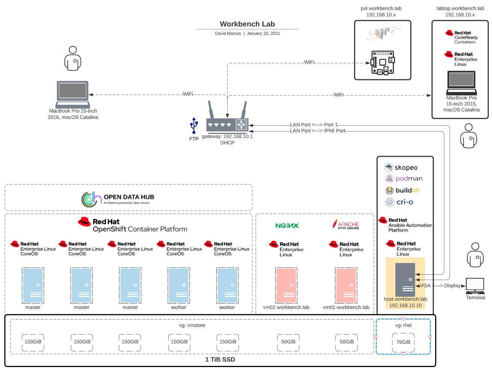

# Workbench Lab

This project describes the hardware and software configuration for my home lab that runs on:
1. GL.iNet AR750S Ext Slate for intranet or internet access.
1. Supermicro SuperServer E200 8D 128GB RAM 1TB Storage for primary compute and server hosting.
1. MacBook Pro (15-inch, 2015) for workstation development.
1. Raspberry Pi 4 Model B for edge device capabilities.

## Background
Multiple iterations of **| provision > run > deprovision > repeat |** have resulted automating the deployment of different stack variations.

# Objectives:
1. Operations: convert manual procedures to automated provisioning for fast repeatable standup and tear down of components.
1. Development: demonstrate mission-grade workload variations running on low cost (sub $5000.00) and small footprint (travel pelican case).

# Bill of Materials
## Primary Compute (wired)
|Component|Product|Qty|Cost|
|:---|:---|:---|:---|
|Server|Supermicro SuperServer E200-8D - Mini-1U - Xeon D-1528 1.9 GHz|1||
|Processor|Intel Xeon D-1528 SoC|1||
|Motherboard|X10SDV-6C-TLN4F|1||
|Memory|Samsung M393A4K40BB1-CRC 32GB DDR4-2400 LP ECC Reg|4||
|Storage|Samsung 970 PRO Series - 1TB PCIe NVMe - M.2 Internal SSD Black/Red (MZ-V7P1T0BW)|1||
|Cooling|Supermicro FAN-0100L4 40X40X28MM 1U-4-Pin PWM Fan SC510 SC511|3||
|Power|110|1||
|Portable Power|Krisdonia AC Outlet Portable Charger 60000mAh 110V/130W|1||
|Network|GL.iNet GL-AR750S-Ext Gigabit Travel AC Router (Slate)|1||
|Travel|New Pelican Black & Red 1450 with Foam|1||

## Peripheral Devices (wireless)
|Component|Product|Qty|Cost}|
|:---|:---|:---|:---|
|Labtop|MacBook Pro (15-inch), 2015|1||
|Single Board Computer|Rasberry Pi 4 Model B|1| |