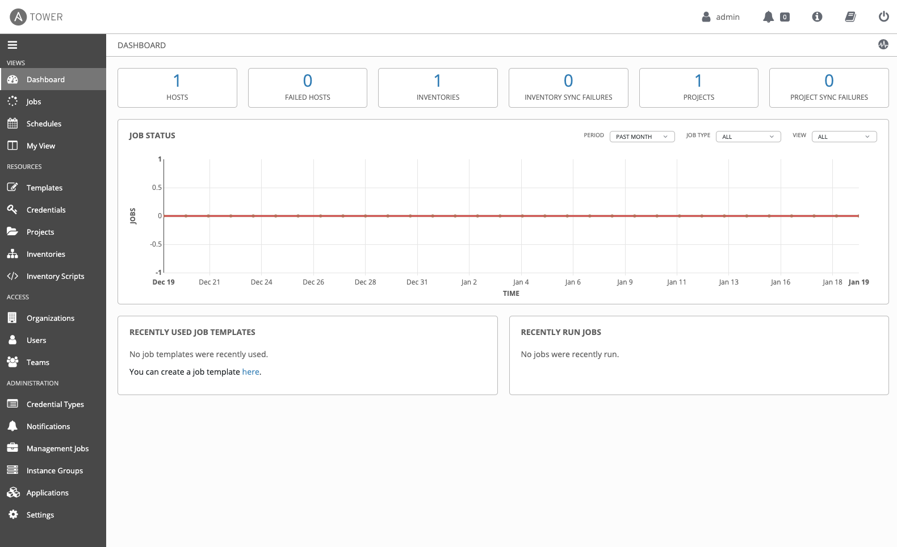

# Install Ansible Tower bundle single machine
[source procedure](https://docs.ansible.com/ansible-tower/latest/html/quickinstall/prepare.html)

## Design
- Single Machine
- Virtual Machine
- RHEL 8.3 x86_64
- Ansible Tower 3.8.1
- port 443 available for Tower UI
- Ansible 2.9
- Automation Hub
- 2 CPU 
- 4 GB RAM
  - 1 GB / 10 Forks
  - 2 GB reserve for Tower
  - 1 GB reserve
- host umask 0022
- 100 GB Storage
  - 60 GB OS
  - 40 GB Tower and Database
- PostgreSQL DB v10

## VM Creation
TODO procedure

## Procedure
1. download installer from https://releases.ansible.com/ansible-tower/setup/ansible-tower-setup-latest.tar.gz
1. unpack the tar
1. go to ansible-tower-setup-<version>/ directory
1. edit the inventory file
1. set the `admin_password`
1. set the `pg_password` (NO special characters)
1. switch to root
1. run the ./setup.sh
1. go to https://tower.workbench.lab/
1. complete subscription
1. accept EULA, analytics, etc. 
1. submit
```
$ wget -p /tmp https://releases.ansible.com/ansible-tower/setup/ansible-tower-setup-latest.tar.gz
$ tar -xf ansible-tower-setup-latest.tar.gz
$ cd ansible-tower-setup-<version>
$ vim inventory
> admin_password=''
> pg_password=''
$ sudo -i
# ./setup.sh
```


